# Mixed Reality Example for Meta-OpenXR Quick Start Guide

Unity’s **Mixed Reality (MR) Example for Meta-OpenXR** provides a starting point for mixed reality development in Unity. The example configures project settings, pre-installs the right packages, and includes various pre-configured Example Assets to demonstrate how to set up a project that is ready for MR. Please refer to the [XR Project Setup](https://docs.unity3d.com/2022.3/Documentation/Manual/xr-create-projects.html) documentation for additional information.

Unity directly supports the following Mixed Reality platforms:
* [OpenXR](https://docs.unity3d.com/Packages/com.unity.xr.openxr@latest/index.html)
* [Oculus/Meta Quest](https://developer.oculus.com/documentation/unity/unity-gs-overview/)
* [HoloLens 2](https://learn.microsoft.com/en-us/windows/mixed-reality/develop/unity/unity-development-wmr-overview)
* [Magic Leap 2](https://developer-docs.magicleap.cloud/docs/guides/unity/getting-started/unity-getting-started/index.html)

The **MR Example** uses the following Unity XR features:
* [AR Foundation](https://docs.unity3d.com/Packages/com.unity.xr.arfoundation@latest/index.html) - Unity’s framework for multiplatform AR development.
* [XR Interaction Toolkit](https://docs.unity3d.com/Packages/com.unity.xr.interaction.toolkit@latest/index.html) - A high-level, component-based, interaction system for creating XR experiences. It provides a framework that makes 3D and UI interactions available from Unity input events.

**Known Limitations:**
* For plane detection to properly work on a Meta Quest device, the new **Room Setup** feature found in **Settings** > **Physical Space** > **Space Setup** needs to already be completed on the Quest headset before entering the build. It is advised to add at least one piece of furniture with a horizontal surface, such as a table.
* The Meta-OpenXR package currently only supports certain types of horizontal plane classifications with an up-facing normal vector: **`Bed`**, **`Table`** and **`Floor`**.
* Meta-OpenXR objects that are NOT currently supported: `Couch`, `Screen`, `Lamp`, `Plant`, `Shelf` and `Other`.
* Currently there is no Link support for Meta Quest devices. Plane detection and passthrough only work after making an Android build. By pressing play in the Unity editor, passthrough and plane detection will not appear.

## Using the Sample Scene

The **MR Example** contains a **Scene** named `SampleScene` located in `Assets/Scenes`.  This scene’s Hierarchy is pre-configured with GameObjects that allow your application to manage controller and hand tracking, interaction with spatial UI and virtual objects, and context-aware features such as plane detection and passthrough.

You can use this Scene as a reference, or you can remove the example Assets from it and use it as a starting point for your own Project.

## Sample Scene Hierarchy Overview

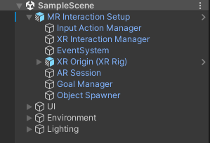

## MR Interaction Setup
The **MR Interaction Setup** in Unity is the main GameObject for configuring the extended reality (XR) camera and the origin point of the XR experience in Unity. The MR Interaction Setup includes additional configuration beyond the basic XR Origin Setup, such as:
* Different input systems such as Controllers and Hands,
* Various interactors (poke, direct, ray) driven by that input.

## Context-Aware Features
The MR Example includes various essential features for mixed reality development, including demonstrating basic plane detection and passthrough.

For plane detection, the **AR Session** controls the lifecycle and configuration options for an AR session and is located in the **MR Interaction Setup** GameObject. There is only one active session. If you have multiple ARSession components, they all communicate to the same session and will conflict with each other. The **AR Plane Manager** creates GameObjects for each detected plane in the environment. The component is located on the same GameObject as the XR Origin component.

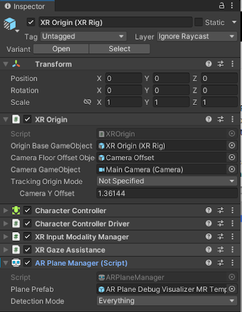

A plane is a flat surface represented by a pose, dimensions, and boundary points. The boundary points are convex. Examples of features in the environment that can be detected as planes are horizontal tables, floors, countertops, and vertical walls. You can specify a **Detection Mode**, which can be horizontal, vertical, or both. Some platforms require extra work to perform vertical plane detection, so if you only need horizontal planes, you should disable vertical plane detection. In addition, the AR Plane Manager allows you to specify a prefab for plane visualization.

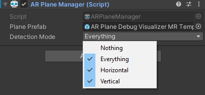

To enable passthrough, the **AR Camera Manager** is included as a component on the Main Camera GameObject. Also, note that the camera background is set to black, with 0 alpha.

## Object Spawner
The **Object Spawner** is located in the **MR Interaction Setup** GameObject and enables you to spawn assets in your space triggered by a collision event from the **Contact Spawn Trigger** GameObject that is attached to the palm of the hand. The **Object Spawner** allows you to customize the objects you would like to spawn using the Object Prefabs list.

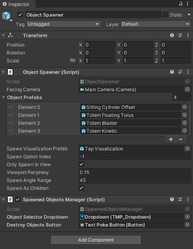

## Interactables
There are various objects in the **Object Spawner** that the user is able to interact with. In XRI, these are called interactables. The grab interactable allows a user to pick up a GameObject using either a direct or ray interactor. Grab interactables need a Rigidbody and a Collider to define the interactable area.

There are (4) different types of interactable examples used with the Object Spawner in the SampleScene. The **Sitting Cylinder Offset** GameObject demonstrates a basic grab interactable that uses physics to interact and collide with the physical environment. The other three, **Totem Floating Torus**, **Totem Blaster**, and **Totem Kinetic**, use the AR Transformer and enable the virtual objects to interact with planes found in the real world.

By grabbing the base of the totems, the user can move the object along a plane found in the physical environment. By grabbing the virtual objects above, the user can explore other types of interactions; floating grab interactables with the **Totem Floating Torus**, passive hand physics interactions with **Totem Kinetic**, and a custom particle blaster interactable with **Totem Blaster**.   

## Affordance System
In addition, the [Affordance system](https://docs.unity3d.com/Packages/com.unity.xr.interaction.toolkit@2.5/manual/affordance-system.html#:~:text=The%20XR%20Interactable%20Affordance%20State,subscribed%20to%20this%20particular%20provider.) provides feedback for the user with visual and auditory cues. This requires the use of the [XR Interactable Affordance State Provider](https://docs.unity.cn/Packages/com.unity.xr.interaction.toolkit@2.5/manual/xr-interactable-affordance-state-provider.html) with a specified interactable source. For the interactables included in the Sample scene, there is an [Audio Affordance Receiver](https://docs.unity3d.com/Packages/com.unity.xr.interaction.toolkit@2.5/api/UnityEngine.XR.Interaction.Toolkit.AffordanceSystem.Receiver.Audio.AudioAffordanceReceiver.html) and a [Color Affordance Receiver](https://docs.unity3d.com/Packages/com.unity.xr.interaction.toolkit@2.5/api/UnityEngine.XR.Interaction.Toolkit.AffordanceSystem.Receiver.Rendering.ColorMaterialPropertyAffordanceReceiver.html) already set up.

### Color Affordance Receiver Example

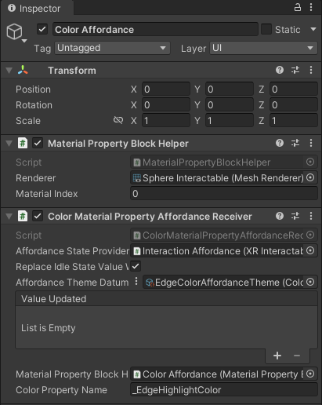

### Audio Affordance Receiver Example

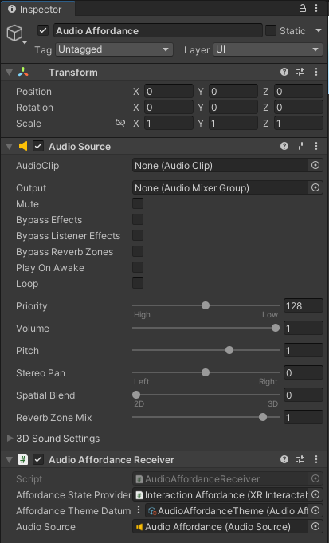

These Affordance Receivers are driven by [Affordance System Themes](https://docs.unity.cn/Packages/com.unity.xr.interaction.toolkit@2.5/manual/affordance-system.html#affordance-themes) found in Assets > MRExampleAssets > Themes.

### Edge Color Affordance Theme Example

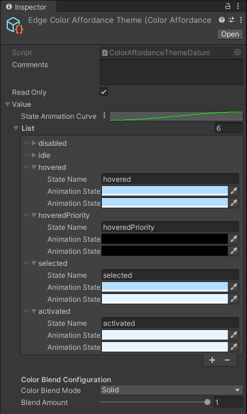

### Audio Affordance Theme Example

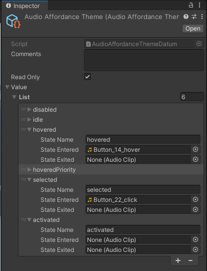

## Spatial UI

The Sample Scene contains various spatial UI examples which allows both near and far interactions with UI elements. There are (3) main examples of spatial UI in the SampleScene. This includes a coaching UI and video player for onboarding users into a new MR application, as well as a menu that is constrained to the user’s hand containing various controls and settings for the SampleScene.

The **Coaching UI** GameObject is controlled by the **Goal Manager** located in the MR Interaction Setup. The Goal Manager controls the progression of content within the UI, turning on/off related GameObjects, as well as altering the **Lazy Follow** behavior depending on the instructions in the step.

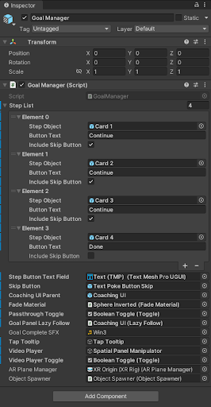

The **Hand Menu Setup** Gameobject includes a basic scroll menu that launches when the user’s palm is facing towards the user. The menu is populated with examples of various list view items including a toggle, button, and dropdown UI element.The interaction follow behavior of the hand menu can be configured in the **Hand Menu Follow Preset** and **Controller Follow Preset**.  

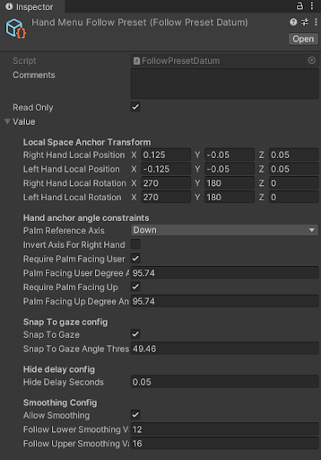

The **Spatial Panel Manipulator** displays a video player to communicate basic input mapping for the SampleScene. User’s have the ability to move the canvas in space by grabbing the canvas by either the header or handle at the bottom of the canvas. Bill-boarding with the Lazy Follow component is on the prefab by default, with the positional transformation of the canvas being determined by the direct/ray interactor.

## Project Configuration

Various presets are used to accommodate graphics & rendering requirements for different platforms. By selecting the target platform in the Build Settings, i.e. Windows, Mac, Linux or Android, different URP Config Settings are automatically updated for the user. The presets can be found in `Assets/Settings/Project Configuration`.

For Quest-based devices, the `Standalone Performant Preset` and `Performant URP Renderer Config` assets provide a good baseline of graphics settings for older model standalone headsets such as the Quest 2. You may also want to experiment with the `Standalone Balanced Preset` and `Balanced URP Renderer Config` for higher-powered standalone headsets such as the Quest Pro and Quest 3.

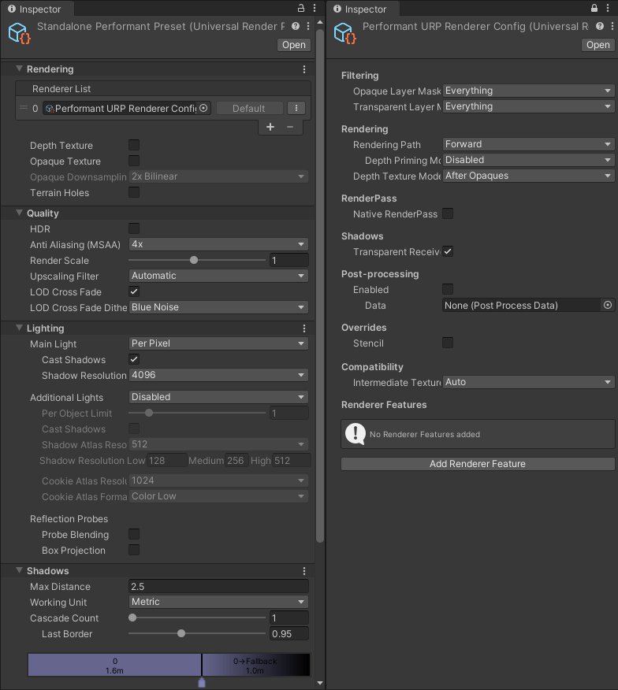

In addition, by selecting the target platform in Build Settings, OpenXR feature groups and interaction profiles are preconfigured. By default, the Android build target updates the settings for Meta Quest support.

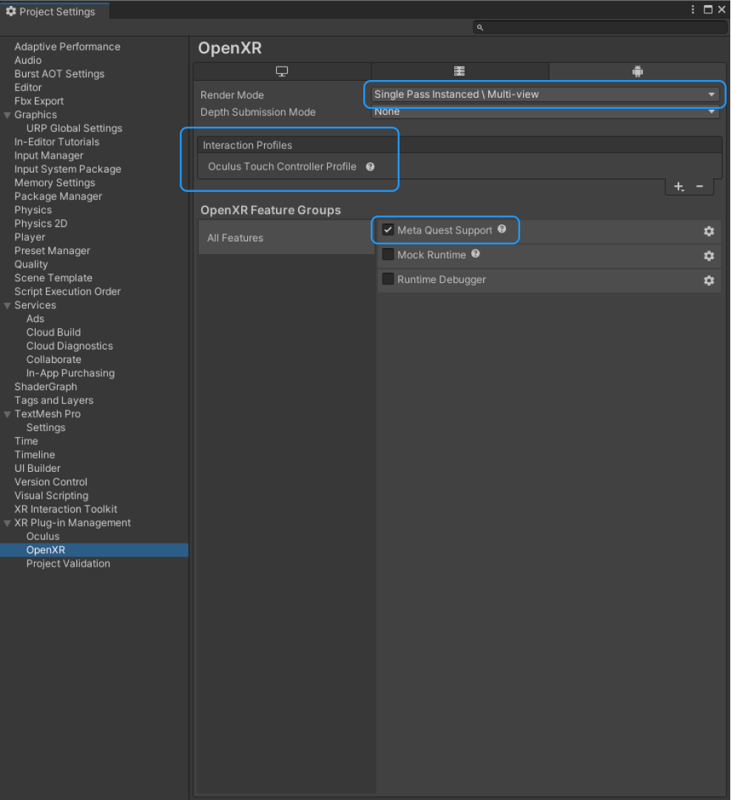
